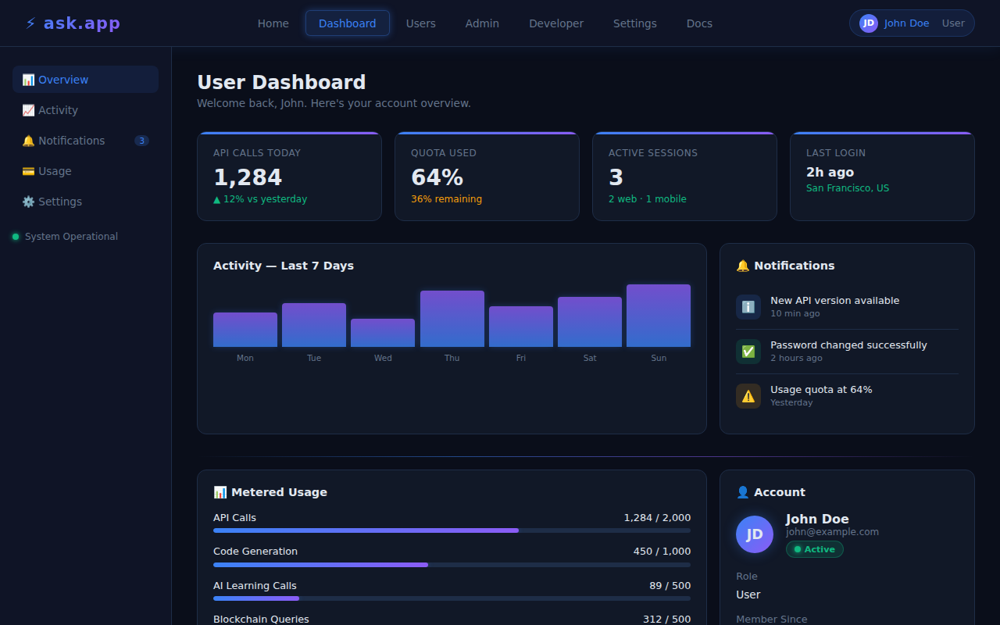
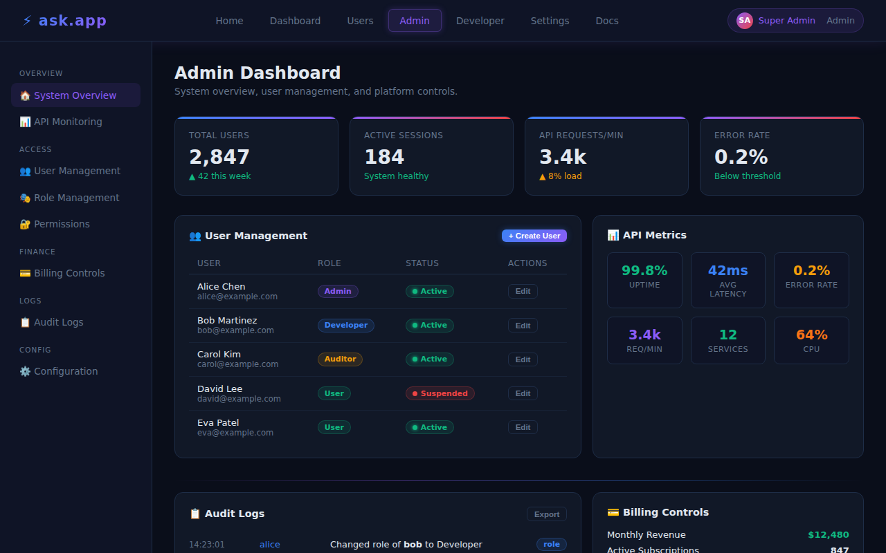

# ask.app

> **Full-stack arbitrage platform** — multilingual AI, wallet integration, real-time analytics, and enterprise-grade access control on Base/Sepolia.

[](https://github.com/SMSDAO/ask.app/actions/workflows/ci.yml)
[](LICENSE)

---

## Overview

ask.app combines an **Express.js API backend**, a **Python FastAPI AI service**, and a **Next.js frontend** to deliver a production-ready arbitrage platform with:

- 🔗 **Blockchain integration** — live queries against Base/Sepolia via public RPC
- 🤖 **AI adaptive learning** — continuous improvement from user interactions
- 💻 **Code generation** — on-demand code snippets via the `scripts/truthApi.js` API
- 🔐 **RBAC authentication** — Admin, Developer, User, and Auditor roles with JWT + bcrypt
- 📊 **Enterprise dashboards** — User, Admin, and Developer dashboards with Neo-Glow design
- 🚀 **CI/CD pipelines** — lint, test, build, release, and security scanning via GitHub Actions

---

## Quick Start

```bash
# 1. Clone and install
git clone https://github.com/SMSDAO/ask.app.git
cd ask.app
npm ci

# 2. Configure environment
cp .env.example .env
# Edit .env — set DATABASE_URL, JWT_SECRET, JWT_REFRESH_SECRET

# 3. Start services
bash deploy/install.sh
```

Services available after startup:

| Service | Port | URL |
|---|---|---|
| Main API | 3000 | `http://localhost:3000` |
| Code-Gen API | 3005 | `http://localhost:3005` |
| AI Service | 8001 | `http://localhost:8001` |

---

## API Reference

| Method | Path | Service | Description |
|---|---|---|---|
| `GET` | `/status` | Main API `:3000` | Simple status check |
| `GET` | `/health` | Main API `:3000` | Health check with uptime |
| `GET` | `/metrics` | Main API `:3000` | Runtime metrics |
| `POST` | `/generate-code` | Code-Gen `:3005` | Generate code snippets |
| `POST` | `/learn` | AI Service `:8001` | Submit learning data |

---

## Architecture

```
Client (Next.js)
     ↓
Express API (port 3000)   ←→   Code-Gen API (port 3005)
     ↓                               ↓
PostgreSQL                     AI Service (port 8001)
     ↓
Base/Sepolia RPC
```

See [`docs/architecture.md`](docs/architecture.md) for the full architecture overview, module map, and security design.

---

## Scripts

```bash
npm run lint       # ESLint (zero warnings)
npm test           # Jest unit tests
npm run build      # Build step
npm start          # Start main API
```

---

## Documentation

| Document | Description |
|---|---|
| [Architecture](docs/architecture.md) | Stack, module map, API routes, data flow |
| [Deployment](docs/deployment.md) | Prerequisites, quick start, production guide |
| [Environment Variables](docs/env-vars.md) | All env var references |
| [User Guide](docs/user-guide.md) | End-user guide |
| [Admin Guide](docs/admin-guide.md) | Admin panel, RBAC, billing |
| [Developer Guide](docs/developer-guide.md) | Local setup, API reference, contributing |

---

## UI Preview

### User Dashboard



### Admin Dashboard



---

## Changelog

See [CHANGELOG.md](CHANGELOG.md) for the full release history.

---

## License

MIT
